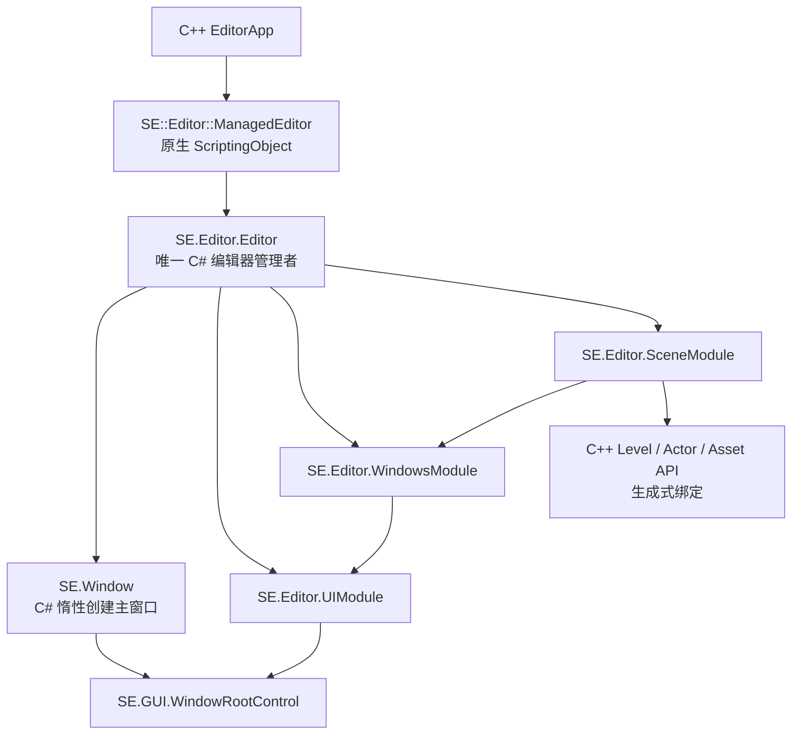

# C# Editor Modules 迁移设计

**状态：** 已实施，已完成静态复核；等待编译与运行态验收  
**日期：** 2026-07-26  
**范围：** 将 Editor 侧 `WindowsModule`、`UIModule`、`SceneModule` 的生命周期编排和 GUI 所有权迁移到 C#；C++ 保留平台窗口、渲染、场景运行时和绑定生成职责。

## 1. 背景与结论

运行时 GUI 迁移设计（`CSharpRuntimeGuiMigrationDesign.md`）已完成托管窗口根和 `Managed` GUI 后端。当前 `EditorApp` 已改为通过原生 `ManagedEditor::GetMainWindow()` 取得由 C# 创建的窗口，而不是直接构造 `GraphicWindow`。这使编辑器主窗口的 GUI 所有权正式切换到 C#。

因此，本设计取代旧设计中“编辑器主窗口保持 `NativeLegacy`”的前提；该替换仅在本设计审核通过并实施后生效。

Flax Graphify 图中的 `WindowsModule`、`UIModule`、`SceneModule` 均由托管 `FlaxEditor.Editor` 持有，并分别负责窗口注册/布局、菜单和停靠工作区、场景与选择服务。Solar 的三个同名模块当前仍是 C++ 模块，且分别直接创建 C++ `EditorWindow`、C++ `MasterDockPanel` 和 C++ 场景树节点，不能在托管根上继续使用。

## 2. 当前状态和必须修正的入口契约

### 2.1 已有入口

- `EditorApp::CreateMainWindow()` 和 `GetMainWindow()` 已从 `managedEditor->GetMainWindow()` 取得窗口。
- `ManagedEditor` 原生侧会反射调用同名托管实例的 `Init`、`Update`、`LateUpdate`、`Render`、`Exit`，并反射调用 `GetMainWindowPtr` 取得 `Window*`。
- `ManagedEditor.cs` 已创建 `SE.Editor.Editor` 单例根对象，这是托管编辑器的正确业务根。
- `SE.Window.Create(CreateWindowSettings)` 已保证创建 `Managed` GUI 后端，窗口拥有唯一的 `SE.GUI.WindowRootControl`。

### 2.2 缺口

`ManagedEditor.cs` 当前定义的 `SE.Editor.Editor` 将扩展为整个 C# 编辑器的唯一管理者：它拥有主窗口、模块容器、生命周期状态和退出清理。C++ `SE::Editor::ManagedEditor` 已使用 `SE_CLASS(API(NoSpawn, Name="Editor"))`，其 C++ 命名空间与别名共同决定直接绑定到 `SE.Editor.Editor`。Reflector 已生成该直接绑定；不新增 C# `SE.ManagedEditor` 适配类，也不新增 `ManagedEditor.Runtime.cs` 或任何等价的运行时入口文件。

`CreateMainWindow()` 可早于托管 `Init()` 被调用。`GetMainWindowPtr` 必须幂等且惰性地创建主窗口；不能依赖 `Editor.Init()` 已运行。C++ 中创建却未传递的 `CreateWindowSettings` 也必须移入该托管工厂，避免标题、无边框和拖放配置失效。

原生 `UIModule` 调用 `GraphicWindow::GetGUI()` 得到的是 C++ `WindowRootControl`。托管窗口没有这棵原生树，故在主窗口改为 Managed 后继续初始化旧 `UIModule` 将导致空指针或双 GUI 树，必须与托管 `UIModule` 的接管原子切换。

## 3. 目标架构

### 3.1 托管入口与生命周期

只修改 `Src/Engine/Editor/ManagedEditor.cs`：保留并扩展其中的 `SE.Editor.Editor`。重新运行 Reflector 后，该 partial 类直接继承生成的 `ScriptingObject` 绑定并成为原生 `SE::Editor::ManagedEditor` 的托管实例。

- `Editor` 持有唯一的主 `SE.Window`、模块容器和生命周期状态。其内部 `EnsureMainWindow()` 创建或返回窗口；创建设置为标题 `SE Editor`、无边框、允许拖放。该方法不得显示、构建模块或注册事件。
- `Editor.GetMainWindowPtr()` 仅调用自身的 `EnsureMainWindow()` 并返回生成式原生指针。
- `Editor.Init()` 在窗口存在后按固定次序初始化 Settings（保留原生）、托管 UI、托管 Scene、托管 Windows；任何重复调用必须是无操作或受控失败。
- `Editor.Update()`、`LateUpdate()`、`Render()` 只转发给已成功初始化的模块；`Editor.Exit()` 以反向依赖次序释放模块、布局状态和窗口订阅。
- 原生 `ManagedEditor::InvokeManagedMethod` 必须初始化异常输出、记录托管异常并停止本次调用；托管异常不可跨越 C++ 边界。

`EditorApp` 只保留应用宿主、项目加载和原生后台服务模块。主窗口以及可见 GUI 控件树由 C# 负责；`ManagedEditor` 在原生模块完成初始化后驱动托管模块。原生模块仍可继续处理缩略图、资产关闭、场景图等尚未生成托管 API 的后台职责，但不得再创建或更新第二棵编辑器 GUI 树。

### 3.2 C# Editor 根与模块基类

在 `Src/Engine/Editor/Modules` 增加 C# `EditorModule` 基类和 `Editor` 的模块容器；所有类型使用 `SE.Editor`，不为模块再增加子命名空间。

模块公共生命周期为 `Initialize`、`EndInitialize`、`Update`、`LateUpdate`、`Render`、`Dispose`。容器负责稳定的初始化/销毁顺序、一次性失败回滚和按类型查询，不允许模块自行创建第二个 `Editor`、主窗口或 GUI 根。

建议顺序如下：

| 顺序 | 所有者 | 职责 |
| --- | --- | --- |
| 1 | `Editor` | 验证主窗口、创建服务容器。 |
| 2 | `UIModule` | 直接以 `Editor.MainWindow.GUI` 构建菜单、工具栏、状态栏和 `MasterDockPanel`。 |
| 3 | `SceneModule` | 连接生成式场景事件、维护根节点、选中对象和保存/加载状态。 |
| 4 | `WindowsModule` | 注册托管窗口，恢复布局，并向 `UIModule` 的停靠工作区显示窗口。 |

### 3.3 UIModule

`UIModule.cs` 直接向 `SE.Window.GUI` 添加 `MainMenu`、`ToolStrip`、工作区、`StatusBar` 和托管 `MasterDockPanel`。它拥有布局恢复/保存、菜单命令注册及主窗口关闭前的布局落盘。

现有 `NativeGuiPresentationHost` 创建的是独立的 `RootControl`，不附着到主窗口，且依赖不存在的 `EditorApplication` / `EditorWindow` 托管 API；它不能作为实际宿主。实施时将其重构为 `UIModule` 内部实现或删除，禁止继续保留平行根控件。

### 3.4 WindowsModule 与窗口范围

`WindowsModule.cs` 负责窗口标识、注册/注销、可见性、聚焦、布局序列化、生命周期和对 `UIModule.MasterDockPanel` 的停靠请求。参考 Flax，首批窗口均为 `EditorWindow` 的具体 C# 子类：`ContentWindow`、`SceneHierarchyWindow`、`LogWindow`、`EditSceneWindow`。`PropertiesWindow` 明确不属于本任务，继续保留为后续独立迁移项，当前不创建托管外壳。

上述四个窗口当前均有 C++ `EditorWindow` 实现，其内容树不能直接加入 C# `WindowRootControl`。迁移后的 C# `EditorWindow` 基类参考 Flax，统一提供注册、停靠、`OnInit`、`OnUpdate`、`OnExit` 和 Level 场景事件分发；具体窗口各自持有内容浏览器、场景树、日志列表或场景编辑承载控件。旧 C++ 窗口不可与托管窗口同时展示。`PropertiesWindow` 的原生代码保持不动，且不在本轮创建托管窗口或迁移其业务内容。

如果审核时不授权这四个外壳，`WindowsModule` 只能完成无界面注册和布局逻辑验证，不能切断 C++ `WindowsModule`，主编辑器也不能宣称功能可用。

### 3.5 SceneModule

`SceneModule.cs` 保持场景根、当前场景、选中对象集合、打开/保存/重新加载状态和场景事件订阅。它只能使用由现有 Reflector 生成的 `Level`、`Actor`、资源和事件 API。

实施前先完成绑定审计：列出 `Level` 保存/加载/卸载、Actor 增删改、场景枚举、对象标识与事件参数的可生成签名。缺失 API 必须在相应 C++ Runtime 类型增加反射标记并重新生成；不添加 P/Invoke、裸指针、`IntPtr` 或 C++ 事件回调捷径。

`SceneModule` 只发布稳定的托管场景/选择模型和通知，避免让业务服务反向依赖控件实现。`SceneHierarchyView` 使用既有 C# `Tree`/`ActorTreeNode` 消费该模型，负责层级呈现与选择同步；创建、复制、粘贴、拖放和上下文命令仍留待窗口业务迁移阶段。

## 4. C++ 接管和兼容策略

| 现有 C++ 内容 | 接管时机 | 处理方式 |
| --- | --- | --- |
| `EditorApp` 主窗口创建 | 第 1 阶段 | 保留通过 `ManagedEditor` 取窗口；删除无效的本地窗口设置构造。 |
| `UIModule` | 第 2 阶段 | 保留原生模块注册，仅作为缩略图等 C++ 后台服务；删除其原生 GUI 创建、布局与停靠调用。 |
| `WindowsModule` | 第 3 阶段 | 首批四个托管外壳注册、显示并完成默认布局；原生模块保留给未迁移 C++ 资产代码的窗口登记/关闭服务，但不创建默认可见窗口。`PropertiesWindow` 不在本阶段迁移。 |
| `SceneModule` | 第 4 阶段 | 托管模块维护场景列表和托管选择模型；原生模块暂保留场景图及 Actor 事件处理，以服务未迁移的 C++ SceneGraph、资源和编辑器窗口代码。 |
| `SettingModule`、`SceneGraphModule`、资产数据库、导入模块 | 本设计外 | 暂保持 C++，经明确的生成式 API 供 C# 使用。 |

接管以 GUI 所有权为边界：不允许 C++ 和 C# 同时创建或布局同一编辑器窗口的 GUI 树。原生后台模块与托管表现层可以并存，前提是二者的职责不重叠。发生托管模块初始化失败时，启动必须终止；不可在同一次启动中部分回退到已废弃的原生 GUI 根。

## 5. 文件规划

| 路径 | 变更 |
| --- | --- |
| `Src/Engine/Editor/ManagedEditor.cs` | 扩展 `SE.Editor.Editor` 为唯一管理者，并实现原生直接调用的生命周期与主窗口方法。 |
| `Src/Engine/Editor/Modules/EditorModule.cs` | 新增托管模块基础类。 |
| `Src/Engine/Editor/Modules/WindowsModule.cs` | 新增托管窗口注册和布局服务。 |
| `Src/Engine/Editor/Windows/EditorWindow.cs` | 新增 Flax 风格托管窗口基类和通用生命周期。 |
| `Src/Engine/Editor/Windows/ContentWindow.cs`、`LogWindow.cs`、`SceneHierarchyWindow.cs`、`EditSceneWindow.cs` | 新增四个具体托管编辑器窗口。 |
| `Src/Engine/Editor/Modules/UIModule.cs` | 新增托管菜单、工具栏、状态栏、停靠根和布局服务。 |
| `Src/Engine/Editor/Modules/SceneModule.cs` | 新增托管场景/选择服务。 |
| `Src/Engine/Editor/Windows/SceneHierarchyView.cs` | 新增由托管场景模型驱动的场景层级树视图。 |
| `Src/Engine/Editor/GUI/NativeGuiPresentationHost.cs` | 移除或重构为附着主窗口根的内部实现。 |
| `Src/Engine/Editor/EditorApp.cpp/.h` | 在每个模块接管阶段删除对应 C++ 注册、更新和窗口停靠代码；保留应用和原生桥。 |
| `Src/Engine/Editor/Modules/CMakeLists.txt` | 显式登记新增的 `.cs` 文件。 |
| 相应 Runtime C++ 类型和 `_Generated` 输出 | 仅在 SceneModule 绑定审计确认缺口时补充反射 API 并重新生成。 |

生成目录只由 Reflector 写入，任何 `_Generated/*.cs` 不手工修改。

## 6. 分阶段实施与验收

1. **入口闭合**：重新运行 Reflector，确认 `SE::Editor::ManagedEditor` 生成到 `SE.Editor.Editor`；在 `ManagedEditor.cs` 扩展 `Editor` 并实现 `GetMainWindowPtr` 惰性创建和异常处理；验证 C++ 可取得同一 `Window*` 两次且未重复创建窗口。
2. **托管 UI 根**：实现 `Editor` 模块容器和 `UIModule`，将菜单、工具栏、状态栏和停靠面板附着到 `MainWindow.GUI`；验证窗口首次显示、DPI 改变、关闭和布局保存。
3. **窗口注册**：实现 `WindowsModule` 与 Content、Scene Hierarchy、Log、Edit Scene 四个托管外壳，验证显示、隐藏、焦点、标签停靠、浮动、关闭以及布局恢复；`PropertiesWindow` 留待后续任务。完成后移除对应原生模块调用。
4. **场景服务**：完成反射 API 审计并提供已加载场景列表、名称、保存入口、托管选择模型及 Actor 事件驱动的层级节点；原生 `SceneModule` 在未迁移的 C++ SceneGraph 和资源代码中继续提供后台服务。
5. **端到端回归**：启动 C# 主窗口，验证菜单命令、窗口布局、场景操作、拖放和退出；重新生成绑定并构建 `SEEditor.CSharp` 与受影响原生目标。任何未迁移模块继续按原生后台边界运行。

## 7. 实施记录

- Reflector 已重新生成 `SE::Editor::ManagedEditor` 到 `SE.Editor.Editor` 的直接绑定；未新增 `SE.ManagedEditor` 或 `ManagedEditor.Runtime.cs`。
- `Editor` 现在惰性创建主 `Window`，拥有 `UIModule`、`SceneModule`、`WindowsModule` 并按依赖顺序转发生命周期。
- 托管 `UIModule` 直接附着 `WindowRootControl`，创建菜单、工具栏、状态栏及 `MasterDockPanel`；旧的平行 PresentationHost 已删除。
- 托管 `WindowsModule` 注册 `LogWindow`、`ContentWindow`、`SceneHierarchyWindow`、`EditSceneWindow` 四个具体可停靠窗口，建立默认布局，并向其转发窗口生命周期和 Level 场景事件；`PropertiesWindow` 按任务边界不迁移、不创建托管窗口。
- `Level` 的场景数量、名称、按索引保存 API，以及场景/Actor 生命周期事件已通过 Reflector 生成给托管 `SceneModule` 使用；托管层级节点据此增量更新，并保留低频场景枚举校正。
- `SceneHierarchyView` 已使用托管 `Tree`/`ActorTreeNode` 呈现 `SceneModule` 的节点树，并双向同步 C# 选择模型；不依赖 C++ `SceneHierarchyWindow`。
- `LogWindow` 已订阅托管 `Debug` 日志处理器并在编辑器更新中安全落入 GUI 列表；`ContentWindow` 封装托管内容浏览器。`EditSceneWindow` 已独立为具体窗口，但场景渲染输出必须等待 `SceneRenderTask` 的生成式 C++→C# 绑定，当前不引入手写互操作。
- 原生 `UIModule`、`WindowsModule` 不再创建默认编辑器 GUI；原生模块继续每帧更新资产数据库、导入队列和缩略图等后台服务，并按反向生命周期清理。
- 绑定生成器已修正 `ScriptingObject` 子类重复声明原生指针和嵌套命名空间 TypeInitializer 的问题；`ScriptingObject.GetUnmanagedPtr` 使 C# 创建的主窗口可被原生 `EditorApp` 正确取得。

## 8. 复核决策

请审核以下结论：

1. `SE::Editor::ManagedEditor` 直接关联 `SE.Editor.Editor`；`ManagedEditor.cs` 内的 `Editor` 是唯一 C# 管理者，不创建 C# `SE.ManagedEditor` 适配层。
2. 主窗口在 `GetMainWindowPtr` 中惰性创建，C# `Init` 不承担窗口创建前置条件。
3. `UIModule`、`WindowsModule`、`SceneModule` 接管表现层后，不再与同职责 C++ GUI 模块并行运行；原生模块仅保留缩略图、资源关闭和未迁移场景图等后台职责。
4. 首批四个窗口的托管外壳是迁移 `WindowsModule` 到可用主编辑器所必需的依赖；`PropertiesWindow` 继续留在原生后续迁移计划中。
5. Scene 侧所有新 C++→C# 能力通过现有 Reflector/Graphify 验证的生成机制增加，不使用手写互操作。
