# Editor Modules、SceneGraph、Windows C# 迁移设计

**状态：** 实施中（第一阶段：绑定审计与 SceneGraph 骨架）  
**日期：** 2026-07-21  
**范围：** 将 `Src/Engine/Editor/Modules`、`SceneGraph`、`Windows` 中由 C++ 构建的编辑器功能逐步转为 C# 实现；`PropertiesWindow` 明确不在本轮迁移范围。

## 1. 目标与边界

编辑器主窗口及停靠根已切换为 C# GUI 树，后续编辑器功能必须使用该唯一根控件。目标不是把 C++ 控件逐字翻译，而是把编辑器的状态、命令、窗口和场景树所有权迁移到 `SE.Editor`（GUI 类型维持 `SE.Editor.GUI`），并通过现有 Reflector 生成机制访问 Runtime。

**强制互操作规则：** C# 访问任何 C++ 类型、对象、方法、属性或事件，均必须先在 C++ 侧按当前项目的反射/脚本宏标记，再由 Reflector 生成 C++ 导出与 C# 包装。业务代码不得直接声明 `DllImport`、传递 `IntPtr`、新增手写导出函数，或建立临时的 C++/C# 回调通道。

本轮包含：

| 区域 | C# 最终职责 | C++ 最终职责 |
| --- | --- | --- |
| `Modules` | 编辑器模块生命周期、设置门面、窗口注册/布局、场景编辑命令、场景图工厂 | 引擎资源、文件系统、导入器、缩略图、渲染、资源数据库/导入模块和生成式 Runtime API |
| `SceneGraph` | 托管场景/Actor 节点模型、树同步、选中状态、节点工厂 | Actor、Scene、Level 的真实数据与事件发射 |
| `Windows` | `EditorWindow` 基类和 Content、Scene Hierarchy、Log、Edit Scene 的可视化及命令 | 仅未迁移窗口的原生代码和运行时渲染后端 |

以下不在本轮范围：`PropertiesWindow` 的 C# 化、属性编辑器重构、Undo/Redo 体系重构，以及与本范围无关的运行时 GUI 改造。

## 2. 审计结论

现有 C++ 代码不仅负责显示控件，存在三类业务耦合：

1. `SceneModule.cpp` 订阅 `Level` 的场景和 Actor 事件，维护 `SceneGraphModule` 节点、选中集，并提供复制、粘贴、删除、生成、打开和保存场景命令。
2. `ContentWindow.cpp`（约 1,890 行）既是窗口，也是资源浏览、导航、重命名、创建、删除、筛选与缩略图请求的编排点；资源模块会直接访问它。
3. `EditorWindow.cpp` 在构造时登记到 `WindowsModule`，而 C++ `EditorWindow` 依赖 C++ `MasterDockPanel`。当前 C# `MasterDockPanel` 是独立的托管控件树，两者不能混接。

因此，迁移顺序必须是“生成式 API 与托管服务 -> 场景/资源模型 -> 托管窗口内容 -> 移除原生表现层”。只替换窗口外壳会保留大量 C++ 到窗口的反向依赖，无法完成所有权切换。

## 3. 目标结构

```mermaid
flowchart TD
    APP["C++ EditorApp"] --> BRIDGE["ManagedEditor bridge"]
    BRIDGE --> EDITOR["SE.Editor.Editor"]
    EDITOR --> MODULES["C# editor modules"]
    MODULES --> UI["UIModule / C# MasterDockPanel"]
    MODULES --> WM["WindowsModule / C# EditorWindow"]
    MODULES --> SM["SceneModule + SceneGraph"]
    SM --> API["Reflector-generated Level / Scene / Actor APIs"]
    API --> RUNTIME["C++ Runtime, assets, importer, renderer"]
    WM --> UI
```

`SE.Editor.Editor` 继续是唯一托管编辑器根。`EditorModule` 的初始化顺序固定为：设置/后台服务、UI、SceneGraph、Scene、Windows、资源数据库、导入。每个 C# 模块只能依赖先初始化的模块，不能自行创建窗口根或平行 GUI 树。

## 4. 分区设计

### 4.1 Modules

| 当前模块 | 迁移方案 |
| --- | --- |
| `EditorModule` | 使用现有 C# 基类；补充失败回滚、依赖检查和统一销毁顺序。 |
| `UIModule` | 保留已有 C# 菜单、工具栏、状态栏、停靠根；移除 C++ 对原生根的创建与布局职责。缩略图服务保持原生后台对象，通过受限托管门面访问。 |
| `WindowsModule` | 由 C# 维护窗口注册表、显示/关闭、布局保存恢复和内容编辑器查询；不再创建 C++ 默认窗口。 |
| `SceneGraphModule` | 移为 C# `SceneGraphFactory`/节点注册表；按 Actor 类型注册托管节点工厂。 |
| `SceneModule` | 维护场景根、选中集、场景与 Actor 事件、复制/粘贴/删除/生成/打开/保存命令；不得以轮询代替引擎事件。 |
| `SettingModule` | 迁移编辑器设置读取、变更通知和 C# 视图模型；底层 ini/项目配置留在 C++ Runtime 或已有生成 API。 |
| `AssetDatabaseModule`、`AssetImportingModule` | **本轮不迁移**。继续作为 C++ 后台服务，负责文件扫描、资源实例、导入执行及其生命周期；仅为 C# 窗口按需公开已有功能的生成式查询/命令接口。 |
| `ToolbarBarModule` | 其现有职责并入 C# `UIModule`，删除重复模块而非维持空壳。 |

任何 Runtime 或 Editor 后台能力缺失时，必须在拥有该能力的 C++ 类型增加符合当前系统的 Flax 风格反射/脚本标记，运行 Reflector 生成 C++ 导出和 C# 包装；禁止为本迁移新增 P/Invoke、裸指针、`IntPtr` 透传、手写导出函数或手写 C++/C# 回调协议。

### 4.2 SceneGraph 与 SceneModule

新增托管节点层：

- `SceneGraphNode`：稳定 ID、父子关系、显示名、激活状态、可展开状态。
- `ActorGraphNode`：持有生成式 `Actor` 包装，监听名称、激活、父级和排序变化。
- `SceneGraphNode`（场景节点）、`RootGraphNode` 与 `ScenesRootNode`：表示加载场景与顶层 Actor。
- `SceneGraphFactory`：按 C# 类型映射创建节点，维护 `ID -> node` 注册表并负责统一释放。
- `SceneModule`：只持有节点模型和选择状态；`SceneHierarchyWindow` 订阅模型变化，不反向成为场景业务所有者。

`Level` 当前仅生成了场景数量、名称和按索引保存等查询入口，尚未生成下列事件/操作。因此第一实施阶段必须补足：场景保存/保存失败/加载/卸载，Actor 生成/删除/改父级/排序/名称/激活，按 ID 查询 Actor/Scene，以及复制、粘贴、删除、创建与异步打开场景所需的 Runtime API。事件从 C++ 触发到 C# 时，使用项目既有的 `INVOKE_EVENT_PARAMS_*` 宏模式和生成器约定，并由生成代码提供托管订阅面；业务层不得绕过该链路。

### 4.3 Windows

先建立 C# `EditorWindow` 抽象基类，负责窗口注册、输入导航、生命周期、内容项引用检查和布局序列化。具体窗口按依赖顺序迁移：

1. **LogWindow**：日志条目模型、过滤、复制、定位与计数；需要日志系统的托管订阅接口。
2. **SceneHierarchyWindow**：搜索、树控件、节点选择、右键菜单、Actor 创建、拖放；依赖完整 `SceneGraph`。
3. **EditSceneWindow**：托管停靠外壳、`EditorGizmoViewport`/RenderTask 的生成式接口与场景选择联动。
4. **ContentWindow**：资源树、内容视图、导航、筛选、文件命令、拖放、缩略图；通过生成式接口调用仍由 C++ 持有的 `AssetDatabaseModule`、`AssetImportingModule`。

每迁移一个窗口，就删除该窗口到 C++ `WindowsModule`、`UIModule` 和资源模块的直接表现层调用，改为服务事件或生成式 Runtime API。C++ `EditorWindow` 及对应窗口类在迁移完成并验证后删除，不保留双实现。

### 4.4 PropertiesWindow（本轮排除）

`PropertiesWindow.cpp` 和 `.h` 保留，不改写为 C#，属性编辑业务也不进入本轮工作。

不过它不能继续作为可见的 C++ 停靠窗口：它要求 C++ `MasterDockPanel*`，而编辑器现在只有 C# `MasterDockPanel`。为保持单一 GUI 根，本轮默认布局和 C# Window 菜单将**不注册/显示 Properties**。其 C++ 源码、选择相关接口和后续迁移入口保留，待属性系统迁移时一次性接入 C# 窗口。

如果必须在本轮继续显示原生 PropertiesWindow，则需要另行批准一个“原生控件承载到托管 GUI”的互操作层；这会改变单一 GUI 根的已定架构，故不纳入本设计。

## 5. C++ 兼容与删除准则

| 阶段 | C++ 保留内容 | 可删除内容 |
| --- | --- | --- |
| 过渡期 | Runtime 资源、导入、渲染、Level 事件发射、缩略图后台 | 不创建第二棵原生菜单/停靠根/默认窗口 |
| SceneGraph 完成 | 事件发射和可生成 Runtime 对象 | C++ `SceneGraphModule`、C++ SceneGraph 节点、C++ `SceneModule` 的同步与选择逻辑 |
| 单窗口完成 | 该窗口所需的 Runtime 后台 | 对应 C++ 窗口类及其 C++ GUI 辅助控件 |
| ContentWindow 完成 | 资源数据库、导入、文件和资产 Runtime 实现 | C++ `ContentWindow` 到资源模块的 UI 回调 |
| 全部完成 | `PropertiesWindow` 及其暂存依赖 | 其余 `Modules`/`Windows`/`SceneGraph` 的编辑器表现层 C++ 代码 |

原生模块不能在 C# 已接管后继续订阅同一 `Level` 事件或维护镜像选中集。过渡期间必须使用明确的功能开关，确保每一种业务事件只有一个编辑器所有者。

## 6. 实施阶段与验收

1. **绑定审计与骨架**：列出所有 C++->C# 缺口，补 Runtime 反射标记并生成；建立 C# SceneGraph 和模块服务接口。
2. **SceneGraph/SceneModule**：迁移事件订阅、树节点、选择及场景命令；验证场景加载、Actor 增删改、复制粘贴和退出释放。
3. **窗口基础与 Log/SceneHierarchy**：实现 C# `EditorWindow`、窗口注册/布局和前两个窗口；验证停靠、浮动、输入、拖放和场景选择同步。
4. **EditScene**：接入托管视口和 RenderTask/Camera/Gizmo 生成接口；验证场景渲染与选择。
5. **ContentWindow**：迁移内容浏览器的表现层和命令编排；资源数据库与导入模块保持 C++ 服务，验证导航、创建、重命名、删除、导入、缩略图与资源关闭。
6. **清理与回归**：删除已接管的 C++ 表现层，重新生成代码，构建 C# 与受影响原生目标，完成启动、布局、场景、资源和退出回归。

生成目录仅由 Reflector 写入；C# 文件加入所属功能目录的 CMake 列表，不集中放入 `CSharp` 目录。

## 7. 审核项

请确认以下决策后开始实施：

1. 本轮 `Modules` 不迁移 `AssetDatabaseModule`、`AssetImportingModule`；它们保留为 C++ 后台服务，C# 仅通过 Reflector 生成接口消费其能力。
2. `PropertiesWindow` 保留 C++ 源码但暂不显示在 C# 默认布局和菜单中；不引入第二棵原生 GUI 树。
3. `SceneModule` 和 `SceneGraph` 的所有事件/操作通过 Reflector 生成 API 与既有事件宏进入 C#，不使用手写互操作。
4. 按“SceneGraph -> Log/SceneHierarchy -> EditScene -> Assets/Content”的顺序逐步删除 C++ 表现层，每阶段仅允许一个所有者。

## 8. 实施记录

- 已使用 Graphify 对 `SceneGraph` 的 20 个代码文件执行结构提取，得到 127 个节点、185 条关系；`ScenesGraphNode`、`ActorGraphNode`、`SceneGraphNode`、`RootGraphNode` 是第一批托管模型对应物。
- 已新增托管 `SceneGraphNode`、`ActorGraphNode`、`ScenesRootNode` 与 `SceneGraphFactory`，并让 `SceneModule` 持有该注册表和根节点。该骨架尚未持有 Runtime Actor/Scene 对象，等待 Reflector 生成绑定后接入。
- 已在 `Level`、`SceneObject`、`Actor`、`Scene` 添加 C# 迁移所需的 `SE_CLASS`、`SE_FUNCTION`、`SE_PROPERTY`、`SE_EVENT` 标记；未手工修改 `_Generated` 输出。
- `Runtime/Level` 的 `SceneObject` 层级使用现有 `SCRIPTING_TYPE` / `SCRIPTING_TYPE_NO_SPAWN` 接入脚本类型；抽象类型额外提供返回空的 `Spawn`，防止生成式绑定实例化它们。所有构造函数均改为经 `SpawnParams` 向 `ScriptingObject` 传递实际派生类型的 `TypeInitializer`，避免创建派生对象时错误沿用基类类型句柄。
- 已修正绑定生成器的事件代码：静态 API 类可生成订阅/取消订阅入口和 C# 回调；普通事件使用 `Action`，只有非 const 引用参数才生成专用委托与 C# `ref`，避免订阅者改写原生只读事件数据。`Actor` 保持可包装的非抽象 API 类型，避免托管封送器把 Actor 事件参数转换为 `null`。
- `SE_EVENT` 生成面已按 Flax 的首订阅绑定、末有效订阅解绑语义完善：重复或无效的取消订阅不会改变原生绑定计数，事件回调在锁外执行；原生 `bool` 绑定参数使用 `UnmanagedType.U1`，并将 C++ 文档注释和有效 C# 特性输出到托管事件。
- 已将托管 SceneGraph 和已有 Editor C# 源显式登记到对应 CMake 文件。
- 本机未找到可运行的 `SE.Reflector.exe`，因此尚未生成或验证本批新的绑定输出；按“不编译测试”要求未触发构建。
