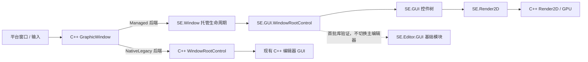

# C# GUI 迁移设计

**状态：** 已审核通过  
**日期：** 2026-07-16  
**范围：** 将 FlaxEngine 的底层运行时 GUI 模块，以及首批编辑器基础 GUI 模块迁移为 SolarEngine 的 C# 实现。

## 1. 目标与边界

### 目标

- 以 `E:\OpenEngineProject\FlaxEngine\Source\Engine\UI\GUI` 为功能参考，将运行时 GUI 的控件树、布局、输入路由和控件绘制逻辑实现到 `Src/Engine/Runtime/UI/GUI` 及其现有功能子目录。
- 新建的 C# 窗口默认使用 C# `WindowRootControl` 作为 GUI 根；C# 游戏脚本可创建、继承和组合 `SE.GUI` 控件。
- 保留 C++ 的窗口、平台输入、GPU/`Render2D`、字体和资源访问能力；C# GUI 通过当前反射/绑定生成器产生的 API 使用这些能力。
- 保留现有 `Src/Engine/Runtime/UI/GUI` 的 C++ 实现，作为 C++ 编辑器 GUI 的兼容后端，不改变其行为。
- 首批迁移 Flax `Editor/GUI` 的 `ContextMenu`、`Docking`、`Drag`、`Input`、`Tree`，以及根目录基础对象；实现放在 `Src/Engine/Editor/GUI` 的对应目录，全部使用 `SE.Editor.GUI` 命名空间。

首批根目录基础对象限定为：`ClickableLabel`、`ColumnDefinition`、`ComboBox`、`EnumComboBox`、`MainMenu`、`MainMenuButton`、`NavigationBar`、`NavigationButton`、`Row`、`StatusBar`、`Table`、`ToolStrip`、`ToolStripButton` 与 `ToolStripSeparator`。

### 不在本次范围内

- 不迁移首批范围以外的 `FlaxEngine\Source\Editor\GUI` 对象，包括 `AssetPicker`、`ItemsListContextMenu`、`PrefabDiffContextMenu`、`PlatformSelector`、`StyleValueEditor`、`CurveEditor*`、`IKeyframesEditor*` 与 `KeyframesEditorUtils`。
- 不迁移 `Editor\Windows`、场景图、资源浏览器、属性编辑器、时间线或其他编辑器业务功能；也不在本次将编辑器主窗口切换为托管 GUI 根。
- 已有 `Src/Engine/Editor/CSharp/GUI` 中属于首批模块的手写 C# 代码将在实施时迁移到 `Src/Engine/Editor/GUI` 的同名功能目录，不能保留重复定义。未迁移 Editor C# 代码和当前编辑器窗口继续使用 C++ 兼容后端。
- 不删除 C++ 运行时 GUI 代码；删除必须等待未来编辑器 GUI 完成托管迁移后另行设计和审批。
- 不复制 `FlaxEngine` / `FlaxEditor` 命名空间、宏、序列化特性或编辑器专属依赖。
- 新增 C# 功能代码不集中放入 `Runtime/CSharp`；必须与所属功能模块同目录放置。`Runtime/CSharp` 保持现有的绑定或通用代码用途，不作为本次 GUI 的目标目录。
- C++ 到 C# 的新增 API 必须使用现有反射/绑定生成器生成；本模块不新增手写 `DllImport`、`LibraryImport`、`extern "C"` 导出或裸句柄包装。

## 2. 现状与设计结论

Flax 运行时目标模块共有 56 个 C# 文件：根目录 19 个、`Brushes` 7 个、`Common` 16 个、`Panels` 14 个。首批 Editor GUI 包含 `ContextMenu` 7 个、`Docking` 6 个、`Drag` 11 个、`Input` 10 个、`Tree` 3 个文件和上述 14 个根目录基础对象。SolarEngine 已有同职责的 C++ 控件体系，且 `GraphicWindow` 当前无条件创建 C++ `WindowRootControl` 并将所有窗口事件直接转发给它。

这意味着不能把 C# 控件当成 C++ 控件的句柄包装。托管窗口必须拥有自己的、唯一的 C# 控件树；同一窗口在一次生命周期中只能选择托管或原生 GUI 后端，不能同时调用两棵控件树。



## 3. 架构与接口

### 3.1 窗口后端选择

在 C++ `CreateWindowSettings` 中增加仅供运行时内部使用的 GUI 后端标记：`NativeLegacy` 与 `Managed`。

- 现有 C++ 创建路径的默认值为 `NativeLegacy`，确保编辑器和其他未改造 C++ 调用方不发生行为变化。
- 新增的 C# `SE.Window.Create(CreateWindowSettings settings)` 工厂始终请求 `Managed`，因此新建 C# 窗口默认拥有 C# GUI 根。
- `SE.Window.GUI` 在托管窗口创建并完成初始化后返回 `SE.GUI.WindowRootControl`；C# API 不公开选择 `NativeLegacy` 的开关。
- C++ `GraphicWindow::GetGUI()` 仅对 `NativeLegacy` 窗口有效。托管窗口不分配 C++ `WindowRootControl`；调用方必须改用后端判断，避免空指针或双重派发。

### 3.2 生成式 C++/C# API 边界

本项目已有与 Flax 相同方向的绑定机制：C++ 反射 API 生成 C# partial 类和 `Internal_*` 互操作声明，同时生成 C++ 侧的注册、封送和 `ScriptingObject` 映射代码。本次迁移遵循该机制，而不是为 GUI 单独建立 P/Invoke 层。

- 窗口、`Render2D`、字体、纹理、Sprite、输入状态、鼠标捕获、光标和拖放等原生能力，优先在其现有 C++ 类型上补充反射 API 标记，再由 Reflector 生成 `Runtime/_Generated` 绑定。
- C# 业务实现只能调用生成后的 `SE.*` API；生成文件不手改，功能扩展写入相邻模块目录中的 C# partial 文件。
- `Window` 保持 `ScriptingObject` 映射。C++ `GraphicWindow` 取得的托管 `SE.Window` 实例是托管 GUI 的唯一宿主，不创建平行的原生句柄包装对象。
- 若某个所需参数、返回值或回调不能由现有生成器正确封送，必须先扩展生成器并单独审核该生成器改动；不能以手写 P/Invoke 绕过生成机制。

### 3.3 托管窗口生命周期桥

`GraphicWindow` 保持平台窗口、交换链和窗口事件订阅职责。使用 `Managed` 后端时，它通过自身已存在的 `ScriptingObject` 映射取得 `SE.Window` 的托管实例，并调用该 partial class 的内部生命周期方法。该模式参照 Flax `Window.Internal_On*` 的窗口事件分派；公开原生成员仍由生成器绑定，`Internal_OnGui*` 仅是运行时内部回调：

| C++ 事件 | `SE.Window` 内部方法 | 托管行为 |
| --- | --- | --- |
| 创建/程序集就绪 | `Internal_InitializeGui` | 建立唯一的 `WindowRootControl`，写入当前逻辑尺寸与 DPI。 |
| 显示 | `Internal_OnGuiShown` | 解锁布局并执行首次布局。 |
| 更新 | `Internal_OnGuiUpdate(float deltaTime)` | 更新控件树、提示和动画。 |
| 绘制 | `Internal_OnGuiDraw` | 绘制 C# 根控件及其子树。 |
| 尺寸或 DPI 变化 | `Internal_OnGuiResize(Float2 logicalSize, float dpiScale)` | 更新根尺寸、DPI 并重新布局。 |
| 键盘、字符、鼠标、触控 | 对应 `Internal_OnGui*` 方法 | 路由到 C# 根控件。 |
| 拖放 | `Internal_OnGuiDragEnter/Over/Drop/Leave` | 创建托管拖放数据并将 `DragDropEffect` 返回原生窗口。 |
| 焦点丢失、关闭 | `Internal_OnGuiFocusChanged`、`Internal_DisposeGui` | 清理输入状态、释放树并断开托管调用。 |

桥接只能在运行时 C# 程序集已加载、窗口尚未关闭且当前 GUI 线程上调用。程序集未就绪时保留最新窗口尺寸和 DPI；不派发用户输入，待初始化后用当前状态完成首次布局。关闭或运行时卸载后不再进入托管代码。

### 3.4 坐标、渲染与宿主服务

- C++ 桥接将平台像素坐标除以窗口 DPI，向托管 GUI 只传递逻辑坐标；根控件尺寸也使用逻辑单位。这样 C# 控件不混用像素坐标和逻辑坐标。
- 托管绘制前由 C++ `GraphicWindow` 压入 DPI 缩放变换，托管根只按逻辑坐标调用 `SE.Render2D`；绘制结束后必定恢复变换栈。
- C# `WindowRootControl` 通过生成的 `SE.Window` API 访问 DPI、客户端尺寸、键盘/鼠标状态、鼠标位置、鼠标捕获、光标设置、窗口焦点和原生拖放启动。
- 拖放数据在边界处转换为托管 `DragDataText` 或 `DragDataFiles`；C# 不持有 `IGuiData*`、原生字符串或原生数组的生命周期。
- 复用现有 `SE.Render2D` 生成绑定。仅当 Flax GUI 所需的绘制、字体、纹理、Sprite 或资源成员尚未暴露时，才在相应 C++ 类型补充可生成的反射 API，并由生成器产生绑定；不为 GUI 添加手写原生导出。

### 3.5 托管 API 与命名

所有运行时 GUI 类型位于 `SE.GUI`，依赖的数学、资源和输入类型继续使用当前 `SE` 命名空间，例如 `SE.Float2`、`SE.Rectangle`、`SE.Color` 与现有输入枚举。

公开层级如下：

```text
SE.Window
  └─ GUI : SE.GUI.WindowRootControl

SE.GUI
  ├─ Control / ContainerControl / RootControl / WindowRootControl
  ├─ Style / Tooltip / Margin / Enums / DragData
  ├─ Brushes/*
  ├─ Common/*
  ├─ Panels/*
  └─ CanvasContainer / CanvasRootControl / CanvasScaler / RenderOutputControl
```

`Control` 保持可继承，公开生命周期、布局、焦点、鼠标、键盘、触控、拖放与绘制扩展点。`WindowRootControl`、窗口桥和原生句柄仅允许运行时程序集内部构造，避免脚本创建没有宿主窗口的根控件。

首批编辑器组件全部位于 `SE.Editor.GUI`。源文件仍按 `ContextMenu`、`Docking`、`Drag`、`Input`、`Tree` 目录分类，但目录不形成子命名空间。它们继承并组合 `SE.GUI` 运行时控件，而不是继续扩展 `EditorNativeGUI` 的原生句柄包装。C# 的 `NativeGui` P/Invoke 包装已删除；未迁移的 C++ 编辑器继续直接使用 `NativeLegacy` 控件树。

由于当前编辑器主窗口仍是 `NativeLegacy` 后端，首批 Editor GUI 的运行验证使用独立的托管窗口，不把其控件树混入当前 C++ 编辑器根。C# `UIModule` 的默认展示宿主为无界面宿主，不主动构建菜单、工具栏或业务窗口；编辑器主窗口改用托管根及其余编辑器模块迁移，属于后续独立设计。

Flax 代码迁移时统一执行以下适配：

- `FlaxEngine.GUI` 改为 `SE.GUI`；不保留 Flax 兼容别名。
- 使用 SolarEngine 的已有数学、资源、输入和日志 API；缺失的数学运算、矩形/颜色辅助函数以 `SE` partial 扩展补齐。
- 移除 Flax 编辑器特性、编辑器引用和与上层业务模块的耦合；运行时控件只保留底层 GUI 语义。
- 将所有 P/Invoke 和原生对象访问收敛到内部桥与 partial 包装类，控件实现不得保存裸 `IntPtr`。

## 4. 实施顺序

1. **托管基础能力与绑定清单**：列出 GUI 所需的窗口、输入、渲染、字体、纹理与数学 API；在对应 C++ 类型补充反射标记，运行 Reflector 验证生成的 C# API、封送和 `ScriptingObject` 映射。随后在功能目录中建立 C# partial 代码：GUI 核心放在 `Runtime/UI/GUI`，数学/颜色/矩形辅助放在 `Runtime/Core/Math`，`Render2D` 扩展放在 `Runtime/Render/2D`，窗口生命周期放在 `Runtime/Core/Platform`。
2. **窗口双后端**：扩展 `GraphicWindow` 与窗口创建设置，实现 `Managed` 分支、程序集延迟初始化、DPI 坐标转换和关闭清理；以 Flax `Window.Internal_On*` 方式将事件分派到托管 `SE.Window`。保留 `NativeLegacy` 分支的现有代码路径不变。
3. **核心控件树**：迁移 `Control`、`ContainerControl`、`RootControl`、`WindowRootControl`、`Style`、`Tooltip`、滚动与拖放；先验证布局、命中测试、焦点、鼠标捕获和绘制状态栈。
4. **基础表现与容器**：迁移画刷、Canvas、面板、滚动条、网格、透明/模糊/下拉容器及 `RenderOutputControl`。
5. **通用控件**：迁移按钮、标签、图片、复选框、下拉框、进度条、滑块、文本框和富文本框；缺失的字体、文本布局与纹理绑定随实际调用补齐。
6. **公开窗口 API 与验收**：完成 C# 窗口创建与 `Window.GUI` API，运行托管 GUI 冒烟场景；确认 C++ 编辑器仍固定使用 `NativeLegacy`。
7. **首批 Editor GUI 库**：将已存在的首批手写 C# 文件从 `Editor/CSharp/GUI` 移动到 `Editor/GUI` 的对应目录，补齐 Flax `ContextMenu`、`Docking`、`Drag`、`Input`、`Tree` 与列出的根目录基础对象；全部改为使用 `SE.GUI` 控件基类和生成的原生 API。
8. **Editor GUI 验证与兼容回归**：在独立托管窗口验证菜单、停靠、拖放、数值/文本输入和树控件；随后启动现有 C++ 编辑器，确认未迁移窗口和 C++ Editor GUI 仍使用 `NativeLegacy` 且行为不变。

每个步骤先完成 C# 编译和无窗口逻辑验证，再进入真实窗口输入/渲染验证。任何阶段都不得把同一个 `GraphicWindow` 的事件发送到两个后端。

## 4.1 当前实施记录（2026-07-19）

- 已完成运行时窗口的 `Managed` / `NativeLegacy` 双后端分流，并由 `SE.Window.GUI` 托管 `SE.GUI.WindowRootControl`；现有 C++ 编辑器窗口保持原生后端。
- 已补齐并经 Reflector 生成 `Font`、`FontAsset`、`TextureBase`、`TextRange`、`TextLayoutOptions` 与 `Render2D` 所需 API；托管代码不手写原生导出或 P/Invoke。
- 首批 Editor C# 源已从 `Editor/CSharp/GUI` 归位到 `Editor/GUI` 的功能目录，且统一为 `SE.Editor.GUI` 单层命名空间。
- 已提供托管 `SE.GUI.Style`、`Panel`、`Label` 与 `Button` 基础控件。控件树支持背景与文本绘制，文本使用生成的 `Font`、文本布局和 `Render2D.RenderText`；调用方通过 `FontAsset.CreateFont` 提供字体实例并可赋给 `Style.Current`。
- 已移除迁移时临时引入的全部 `EditorGui*` 包装类型。Editor GUI 容器直接继承 `SE.GUI.ContainerControl`，`NavigationBar` 直接继承 `SE.GUI.Panel`，`ComboBox` 与 `MainMenuButton` 直接继承 `Control`，`NavigationButton` 直接继承 `Button`，标签、按钮、面板和根控件均直接使用运行时 `Label`、`Button`、`Panel`、`RootControl`；新增 `SE.GUI.TextBoxBase` 和 `TextBox`，使 `SearchBox` 与 `ValueBox<T>` 回到 Flax 对应的文本输入继承链。
- 已将渲染输出的通用控件下沉至运行时 `SE.GUI.RenderOutputControl`；它负责渲染任务关联、逻辑后备缓冲尺寸、分辨率缩放和窗口附着判断。`RenderOutputViewport` 现仅作为 Editor 专用派生类；实际 GPU 纹理创建、任务输出绑定和绘制仍待 Runtime 图形 API 完整暴露后接入。
- 首批 Editor 控件树直接建立在 `SE.GUI.Control` / `ContainerControl` 上，并已接入托管鼠标捕获、按钮点击、树选择/展开、外部文本拖放和数值框拖动滑块。
- `ContextMenu` 已改为托管弹出层：打开时在放置目标所属根控件挂载菜单面板，关闭时解除挂载；按钮、分隔线和子菜单入口均由托管控件构成，子菜单项点击后会打开其子菜单，关闭父菜单会同步解除所有已打开子菜单，不再依赖旧 Editor GUI 的原生菜单句柄。
- `Docking` 已接入托管标签栏鼠标选择、关闭、中键关闭、右键菜单、标签排序和离开标签栏后的浮动；`DockTop`、`DockLeft`、`DockBottom`、`DockRight` 以嵌套面板和分割比例参与托管布局。停靠窗口隐藏时会解除停靠并选中相邻标签，避免隐藏的选中页残留。
- 当 `MasterDockPanel` 位于 `SE.GUI.WindowRootControl` 时，浮动停靠页会通过 `SE.Window.CreateManaged` 创建独立托管窗口，并将浮动面板作为该窗口根的子控件；面板会随宿主根尺寸变化而拉伸。无原生宿主的 `RootControl` 逻辑验证仍将浮动面板挂到同一根，便于不启动平台窗口的测试。
- 已完成无窗口联合冒烟：树节点展开后同级重新布局、树拖放状态清理、数值编辑和滑动、搜索输入、停靠标签选择/排序/隐藏/浮动，以及左右和顶部拆分停靠均通过。
- 已按 Flax 的资源托管对象模型并结合当前 `ScriptingObject` / Reflector 体系，完成 `GPUResource` 与 `GPUResourceView` 的非生成式脚本类型注册；`GPUBuffer`、`GPUTexture`、`GPUSampler`、`GPUShader` 与 `GPUPipelineState` 均使用对应的 `TypeInitializer` 构造，并严格保留 Flax 的 `Sealed`、`NoSpawn` 与 `HideInEditor` 标注语义。Flax 未标注为脚本类型的 `GPUConstantBuffer`、`GPUTimerQuery`、`GPUSwapChain` 继续作为原生 GPU 资源，不生成 C# 类型。资源释放继续先执行 GPU 释放，再转发至 `ScriptingObject::OnDeleteObject`。Reflector 已生成相应 C# 继承关系（资源根和视图根均继承 `SE.Scripting.ScriptingObject`），此前 `GPUResource.h` 的原生编译阻断已消除。
- 已补齐 Flax 定义的 GPU 资源工厂：`GPUBuffer`、`GPUTexture`、`GPUSampler`、`GPUPipelineState` 的 `Spawn(const SpawnParams&)` 和 `New()` 均委托当前 `GPUDevice` 创建后端资源。由于 SolarEngine 的全局分配器也名为 `New<T>`，`GPUBuffer` 成员中原有的异步任务分配改为显式 `::SE::New<T>`，避免被同名静态工厂遮蔽。生成的类型注册单元已成功编译。
- 已在 Visual Studio x64 开发环境复核原生窗口路径：`SERuntimeCSharp`、`SEEditorCSharp` 与受影响的 GPU 资源及 Vulkan 后端对象文件均成功编译。完整 `SERuntime` 当前仍在无关的既有错误 `Runtime/Utilities/Variant.cpp` 中止，原因是缺少 `Runtime/Scripting/ManagedCLR/CLRClass.h`；实际平台窗口的显示、关闭和渲染回归需在该独立构建问题修复后执行。
- 删除了 C# 到旧 `EditorNativeGUI` 的直接 P/Invoke 依赖；保留 C++ 原生 GUI 和其旧兼容实现，未切换编辑器业务 UI。
- 运行时基础 GUI 现已补齐托管画刷 `IBrush`、`SolidColorBrush`、`TextureBrush`，通用控件 `Border`、`Spacer`、`CheckBox`、`ProgressBar`、`Slider`、`Image`、`ClickableLabel`，以及 `PanelWithMargins`、`VerticalPanel`、`HorizontalPanel`、`SplitPanel`、`ScrollableControl`、`Panel`、`HScrollBar` 与 `VScrollBar`。`Panel` 会按内容范围显示并同步双滚动条，滚动内容受视口裁剪而滚动条保持在覆盖层；控件屏幕坐标也已正确纳入父级滚动偏移。
- `RootControl` 已修复空白区域命中时将事件回送自身造成的递归问题，并内建托管 `Tooltip` 覆盖层。调用方设置 `Control.TooltipText` 后，提示会在根控件内延时显示、随根坐标裁剪、且不参与输入命中；它不创建额外的原生 `GraphicWindow`。
- 首批 Editor 根对象已补齐 `ClickableLabel`、`ColumnDefinition`、`Row` / `ClickableRow`、`Table`、`EnumComboBox`；Input 已补齐有符号/无符号整型、长整型和双精度 `ValueBox`、`SliderControl` 及 `ColorValueBox`；Tree 已补齐 `TreeNodeWithAddons`；ContextMenu 已补齐 `ContextMenuSingleSelectGroup<T>`；Drag 已补齐 `DragNames` 与以 `System.Type` 表示 GUI 控件类型的 `DragControlType`。全部仍在 `SE.Editor.GUI` 单层命名空间中。
- `ColorValueBox` 当前使用 `#RRGGBB` / `#RRGGBBAA` 文本编辑；`DragScripts` 与 `DragScriptItems` 未虚构实现，因为当前托管侧尚不存在可生成的 `Script`、`ScriptItem`、`ScriptType` API。`SpriteBrush` 同样保留为后续绑定项：当前生成的 `SpriteHandle` 只有封送占位结构，没有可安全使用的托管属性或构造 API。以上三项需先在对应 C++ 类型补充反射/生成支持，不能用手写互操作替代。
- 本轮无窗口验证已通过：基础控件点击与空根输入、垂直/拆分布局、可滚动 `Panel` 的范围/滚动条同步及置顶、托管 Tooltip 的延时打开和离开关闭，以及先前 Editor 的输入与根对象验证。所有迁移 C# 文件现已在所属 `CMakeLists.txt` 中作为 `RUNTIME_ADD` / `EDITOR_ADD` 输入登记，确保 C# 源变更会触发相应 CMake 自定义构建命令；`SERuntime.CSharp` 已成功构建（609 条既有数学/互操作可空性警告、0 错误）。`SEEditor.CSharp` 重新实际编译后暴露 57 个既有集成错误：`DragActors`、`DragAssets`、`DragItems`、`ActorTreeNode` 与 Presentation Host 依赖尚未生成的 `SceneGraphNode`、`ContentItem`、`EditorApplication`、`EditorWindow` 托管 API。它们属于上层 Editor 业务类型，需在后续独立绑定设计中补齐，不能通过手写 P/Invoke 伪造。
- `WindowBase` 已按 Flax 的 `INVOKE_EVENT_PARAMS_*` / 拖放回调模式覆盖字符、键鼠、触控、拖放、命中测试、关闭、显示、尺寸、焦点、更新和绘制分发；宏实现使用当前 `CLRClass`、`CLRMethod`、`CLRException`、`CLRCore` 与 `CLRUtils`，不再依赖已不存在的 Flax `M*` API 或未在本工程定义的 `USE_CSHARP` 编译开关。`SE.Window.Internal_On*` 负责窗口级托管事件（命中测试、关闭和拖放结果可回写），而 `GraphicWindow` 保持唯一的 `Internal_OnGui*` 控件树分发，避免双后端或双重 GUI 派发。`SERuntime.CSharp` 与受影响的 `WindowBase.cpp` 对象均已在 VS x64 Debug 环境编译通过。

## 5. 构建、兼容性与测试

- 新 C# 文件与所属模块同目录放置：运行时 GUI 位于 `Src/Engine/Runtime/UI/GUI`，数学辅助位于 `Runtime/Core/Math`，渲染包装位于 `Runtime/Render/2D`，窗口桥接位于 `Runtime/Core/Platform`；首批 Editor GUI 位于 `Src/Engine/Editor/GUI` 及其对应子目录。每个文件既由模块根 `.csproj` 的 SDK glob 编译，也必须列入其目录的 `RUNTIME_ADD` / `EDITOR_ADD`，使 CMake 自定义 C# 目标正确追踪源文件变更；不创建 `Runtime/SCharp` 或 `Runtime/CSharp/GUI`。
- 新增或扩展的 C++ 宿主 API 位于其所属运行时或编辑器模块并加入相应 CMake 列表，同时通过正常 Reflector 流程更新 `Runtime/_Generated` 或 `Editor/_Generated`。不手改生成输出。
- 现有 C++ `Runtime/UI/GUI` 和 `Editor/GUI` 保持可编译，并作为原生兼容回归基线。

验收分为三层：

1. **托管逻辑测试**：验证父子关系、锚点/边距、布局锁、排序、命中测试、焦点、鼠标捕获、触控、拖放效果和 Dispose 后状态；这些测试不依赖实际窗口。
2. **窗口集成冒烟测试**：由 C# 创建窗口，确认默认取得托管根；覆盖 DPI 调整、窗口尺寸变化、键鼠输入、拖放、文本输入、滚动、裁剪和绘制状态栈平衡。
3. **首批 Editor GUI 集成测试**：在独立托管窗口组合 ContextMenu、Docking、Drag、Input、Tree 与根目录基础对象，验证菜单打开/关闭、停靠与浮动、拖放效果、数值和文本编辑、树节点选择与布局。
4. **兼容回归**：启动 C++ 编辑器，确认其窗口使用 `NativeLegacy` 根，停靠、菜单、属性面板、内容浏览器与视口不因托管 GUI 引入而改变。

通过条件：Reflector 生成成功且生成输出无手工修改、CMake Debug 构建成功、`SERuntimeCSharp` 构建成功、三层验证完成，并且日志中不存在托管回调异常、窗口关闭后的回调、双后端派发或 Render2D 栈不平衡。

## 6. 风险与约束

- 当前托管数学与资源绑定较薄；以实际 GUI 调用点为准补齐最小 API，避免不受控地复制 Flax 的整个运行时。
- 文本编辑和富文本依赖字体、文本布局、剪裁与输入法边界，是集成风险最高的控件组，应在基础控件之后迁移。
- C++ 编辑器依赖原生 GUI 类型；首批 Editor GUI 虽完成 C# 库迁移，但不切换当前主编辑器根，因此本次只能并存，不能删除 C++ GUI。
- 用户脚本不得保存内部桥对象或原生窗口指针；窗口关闭、程序集卸载与脚本异常必须终止后续 GUI 回调。

## 7. 审核确认项

请审核以下决策：

- [ ] 迁移范围包含 Flax `Engine/UI/GUI`，以及 `Editor/GUI` 的 ContextMenu、Docking、Drag、Input、Tree 和文档列出的根目录基础对象；不包含编辑器业务窗口。
- [ ] 新建 C# 窗口默认使用 `SE.GUI.WindowRootControl`。
- [ ] C++ `Runtime/UI/GUI` 保留为 `NativeLegacy` 兼容后端，当前编辑器继续使用它。
- [ ] 同一窗口仅能启用一个 GUI 后端。
- [ ] 公共 API 使用 `SE` / `SE.GUI` 命名，不提供 Flax 兼容层。
- [ ] C# 功能代码按当前模块目录归属放置，不集中放入 `Runtime/CSharp`。
- [ ] 首批编辑器组件统一使用 `SE.Editor.GUI`，目录分类不增加子命名空间。
- [ ] 新增 C++ 到 C# 的 API 全部由当前反射/绑定生成器生成，窗口回调遵循 Flax `Window.Internal_On*` 设计；不引入手写 P/Invoke 或裸句柄互操作。
- [ ] 首批 Editor GUI 在独立托管窗口完成验证；当前 C++ 编辑器主窗口继续使用 `NativeLegacy`，不在本次切换。
- [ ] 确认后按第 4 节顺序实施，并在每层完成对应验收后继续。
